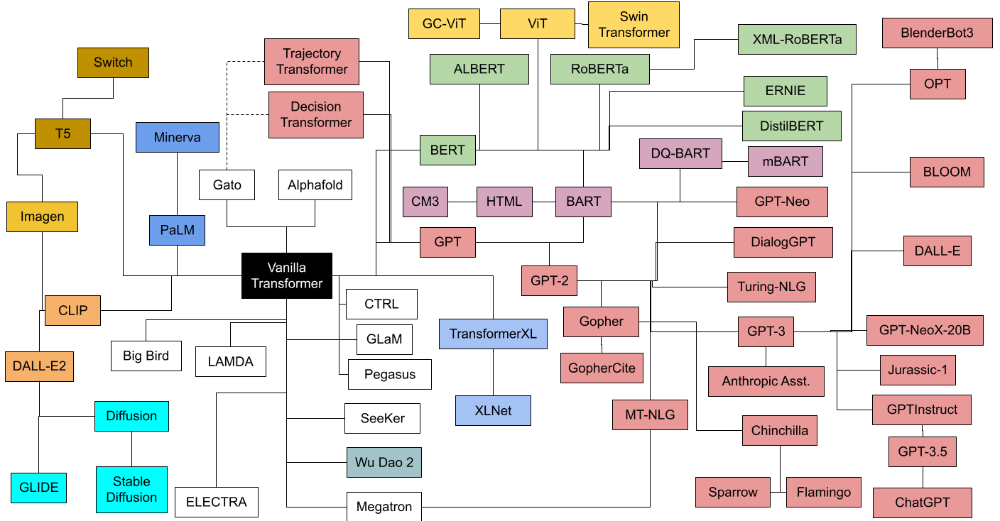
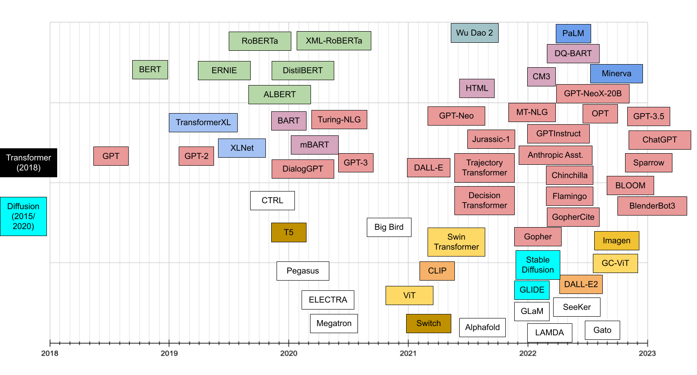

# Papers and Articles Collection

**Purpose: Share what I've read**

**宗旨: 学习分享**

-------------    **Updating Forever**    --------------

# Topic-1 — Transformers

## 1. Articles List 文章列表

1. [The Illustrated Transformer](https://jalammar.github.io/illustrated-transformer/)
2. [Interfaces for Explaining Transformer Language Models](https://jalammar.github.io/explaining-transformers/)

## 2. Papers List 论文列表

1. [Transformer Models : An Introduction and catalog](https://arxiv.org/pdf/2302.07730.pdf)

   Img_01 : Transformers Family Tree

   

​		Img_02 : Transformer timeline

​		

​	2. [A Survey of Transformers](https://arxiv.org/pdf/2106.04554.pdf)

# Topic-2 — Prompt / In-Context Learning

## 1. Articles List 文章列表

1. [How does in-context learning work? A framework for understanding the differences from traditional supervised learning](https://ai.stanford.edu/blog/understanding-incontext/)

2. [Extrapolating to Unnatural Language Processing with GPT-3's In-context Learning: The Good, the Bad, and the Mysterious](https://ai.stanford.edu/blog/in-context-learning/)

## 2. Papers List 论文列表

1. [复旦 Late Prompt Tuning: A Late Prompt Could Be Better Than Many Prompts](https://arxiv.org/pdf/2210.11292.pdf)

   [github项目](https://github.com/xyltt/LPT)

2. [清华 ProQA: Structural Prompt-based Pre-training for Unified Question Answering](https://arxiv.org/pdf/2205.04040.pdf)

   [github项目](https://github.com/zhongwanjun/ProQA)

3. [清华 OpenPrompt: An Open-source Framework for Prompt-learning](https://arxiv.org/pdf/2111.01998.pdf)

   [github项目](https://github.com/thunlp/OpenPrompt)

4. [斯坦福 An Explanation of In-context Learning as Implicit Bayesian Inference](https://arxiv.org/pdf/2111.02080.pdf)

   [github项目](https://github.com/p-lambda/incontext-learning)

# Topic-3 — Sentiment Analysis

## 1. Articles List 文章列表

waiting 。。。

## 2. Papers List 论文列表

1. [美团 ASAP: A Chinese Review Dataset Towards Aspect Category Sentiment Analysis and Rating Prediction](https://arxiv.org/pdf/2103.06605.pdf)

   [github项目](https://github.com/Meituan-Dianping/asap)

2. [复旦 A Unifified Generative Framework for Aspect-Based Sentiment Analysis](https://arxiv.org/pdf/2106.04300.pdf)

   [githu项目]( https://github.com/yhcc/BARTABSA)

3. [CPED: A Large-Scale Chinese Personalized and Emotional Dialogue Dataset for Conversational AI](https://arxiv.org/pdf/2205.14727.pdf)

   [github项目](https://github.com/scutcyr/CPED)

